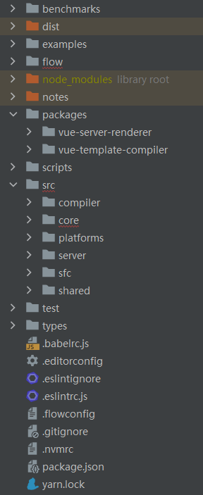
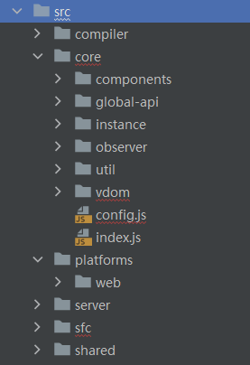

# Vue 2.6.14 源码阅读笔记

## 工程目录结构

清理了一些不影响理解Vue原理的文件后如下：



* examples: 一些官方的Vue使用示例
* flow: 源码文件主要是js，用[flow](https://flow.org/)做Type Check
* packages：两个包都是代码自动生成的，用于单独发布npm仓库，核心代码在src
* scripts：包括git-hooks, 构建，发布等工程脚本
* test：单元测试、端到端测试、服务端渲染测试
* types：ts类型定义
* src：源码核心



## src/core/index.js

```js
// 省略服务端渲染相关的代码后
import Vue from './instance/index'
import { initGlobalAPI } from './global-api/index'

initGlobalAPI(Vue)

Vue.version = '__VERSION__'

export default Vue
```

## src/core/instance/index.js

```js
import { initMixin } from './init'
import { stateMixin } from './state'
import { renderMixin } from './render'
import { eventsMixin } from './events'
import { lifecycleMixin } from './lifecycle'

function Vue (options) {
  this._init(options)
}

initMixin(Vue)
stateMixin(Vue)
eventsMixin(Vue)
lifecycleMixin(Vue)
renderMixin(Vue)

export default Vue
```

终于看到，**Vue的本质是一个函数！**而且使用了this，说明用的时候要new一下

```js
import Vue from "vue";
import App from "./App.vue";
import router from "./router";
import store from "./store";

Vue.config.productionTip = false;

new Vue({
  router,
  store,
  render: (h) => h(App),
}).$mount("#app");
```

