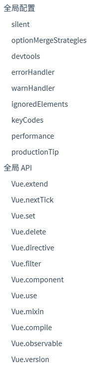
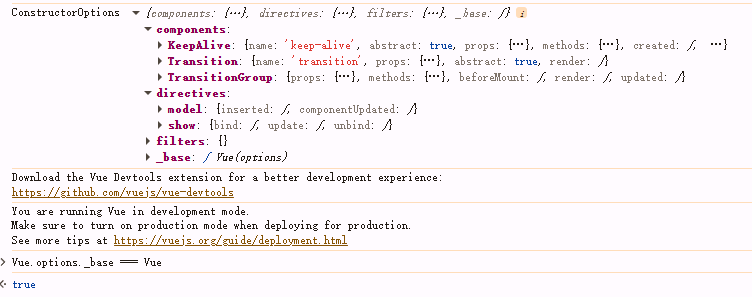
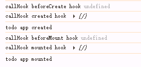

# Vue 初始化流程

## src/core/global-api/index.js

看下如何给Vue增加全局api

我们先看下Vue文档有哪些全局api



```js
export function initGlobalAPI (Vue: GlobalAPI) {
  // config
  const configDef = {}
  configDef.get = () => config
  if (process.env.NODE_ENV !== 'production') {
    configDef.set = () => {
      warn(
        'Do not replace the Vue.config object, set individual fields instead.'
      )
    }
  }
  Object.defineProperty(Vue, 'config', configDef)

  // exposed util methods.
  // NOTE: these are not considered part of the public API - avoid relying on
  // them unless you are aware of the risk.
  Vue.util = {
    warn,
    extend,
    mergeOptions,
    defineReactive
  }

  Vue.set = set
  Vue.delete = del
  Vue.nextTick = nextTick

  // 2.6 explicit observable API
  Vue.observable = <T>(obj: T): T => {
    observe(obj)
    return obj
  }

  Vue.options = Object.create(null)
  ASSET_TYPES.forEach(type => {
    Vue.options[type + 's'] = Object.create(null)
  })

  // this is used to identify the "base" constructor to extend all plain-object
  // components with in Weex's multi-instance scenarios.
  Vue.options._base = Vue

  // 这里添加了 keep-alive 组件
  extend(Vue.options.components, builtInComponents)

  initUse(Vue)
  initMixin(Vue)
  initExtend(Vue)
  initAssetRegisters(Vue)
}
```

### Vue.config

```js
export default ({
  /**
   * Option merge strategies (used in core/util/options)
   */
  // $flow-disable-line
  optionMergeStrategies: Object.create(null),

  /**
   * Whether to suppress warnings.
   */
  silent: false,

  /**
   * Show production mode tip message on boot?
   */
  productionTip: process.env.NODE_ENV !== 'production',

  /**
   * Whether to enable devtools
   */
  devtools: process.env.NODE_ENV !== 'production',

  /**
   * Whether to record perf
   */
  performance: false,

  /**
   * Error handler for watcher errors
   */
  errorHandler: null,

  /**
   * Warn handler for watcher warns
   */
  warnHandler: null,

  /**
   * Ignore certain custom elements
   */
  ignoredElements: [],

  /**
   * Custom user key aliases for v-on
   */
  // $flow-disable-line
  keyCodes: Object.create(null),

  /**
   * Check if a tag is reserved so that it cannot be registered as a
   * component. This is platform-dependent and may be overwritten.
   */
  isReservedTag: no,

  /**
   * Check if an attribute is reserved so that it cannot be used as a component
   * prop. This is platform-dependent and may be overwritten.
   */
  isReservedAttr: no,

  /**
   * Check if a tag is an unknown element.
   * Platform-dependent.
   */
  isUnknownElement: no,

  /**
   * Get the namespace of an element
   */
  getTagNamespace: noop,

  /**
   * Parse the real tag name for the specific platform.
   */
  parsePlatformTagName: identity,

  /**
   * Check if an attribute must be bound using property, e.g. value
   * Platform-dependent.
   */
  mustUseProp: no,

  /**
   * Perform updates asynchronously. Intended to be used by Vue Test Utils
   * This will significantly reduce performance if set to false.
   */
  async: true,

  /**
   * Exposed for legacy reasons
   */
  _lifecycleHooks: LIFECYCLE_HOOKS
}: Config)

const configDef = {}
configDef.get = () => config
Object.defineProperty(Vue, 'config', configDef)
```

### initUse

```txt
src/core/global-api/use.js
```

```js
export function initUse (Vue: GlobalAPI) {
  Vue.use = function (plugin: Function | Object) {
    // 防止重复安装
    const installedPlugins = (this._installedPlugins || (this._installedPlugins = []))
    if (installedPlugins.indexOf(plugin) > -1) {
      return this // return Vue to allow chaining
    }

    // additional parameters
    const args = toArray(arguments, 1)
    args.unshift(this) // 将 Vue 作为第一个参数传入插件，方便插件扩展 Vue
    if (typeof plugin.install === 'function') {
      // 插件是一个带有 install 方法的对象
      // 等价于 plugin.install(Vue, ...args)
      // install 中的 this 是 plugin 对象本身
      plugin.install.apply(plugin, args)
    } else if (typeof plugin === 'function') {
      // 插件是一个函数
      plugin.apply(null, args)
    }
    installedPlugins.push(plugin)
    return this
  }
}
```

### initMixin

```txt
src/core/global-api/mixin.js
```

```js
export function initMixin (Vue: GlobalAPI) {
  Vue.mixin = function (mixin: Object) {
    this.options = mergeOptions(this.options, mixin)
    return this  // 用在 resolveConstructorOptions 里 Ctor.options
  }
}
```

### initExtend

```txt
src/core/global-api/extend.js
```

```js
export function initExtend (Vue: GlobalAPI) {
  /**
   * Each instance constructor, including Vue, has a unique
   * cid. This enables us to create wrapped "child
   * constructors" for prototypal inheritance and cache them.
   */
  Vue.cid = 0
  let cid = 1

  /**
   * Class inheritance
   */
  Vue.extend = function (extendOptions: Object): Function {
    extendOptions = extendOptions || {}
    const Super = this // this 不一定是 Vue，可能多层继承
    // const A = Vue.extend({...})
    // const B = A.extend({...})
    const SuperId = Super.cid
    const cachedCtors = extendOptions._Ctor || (extendOptions._Ctor = {})
    if (cachedCtors[SuperId]) {
      return cachedCtors[SuperId]
    }

    const name = extendOptions.name || Super.options.name

    // 经典原型继承
    const Sub = function VueComponent (options) {
      this._init(options)
    }
    // 比如 Vue.options.components 会合并到子组件上
    Sub.prototype = Object.create(Super.prototype)
    // 修复 constructor 指向（否则 Sub.prototype.constructor 会变成 Super）
    Sub.prototype.constructor = Sub
    Sub.cid = cid++

    Sub.options = mergeOptions(
      Super.options,
      extendOptions
    )
    Sub['super'] = Super

    // For props and computed properties, we define the proxy getters on
    // the Vue instances at extension time, on the extended prototype. This
    // avoids Object.defineProperty calls for each instance created.
    // 提前定义在原型上，避免每创建一个实例就重复 Object.defineProperty。
    if (Sub.options.props) {
      initProps(Sub)
    }
    if (Sub.options.computed) {
      initComputed(Sub)
    }

    // 复制静态方法到子类上
    // allow further extension/mixin/plugin usage
    Sub.extend = Super.extend
    Sub.mixin = Super.mixin
    Sub.use = Super.use

    // create asset registers, so extended classes
    // can have their private assets too.
    // 这样子类构造函数也可以注册自己的局部资产
    ASSET_TYPES.forEach(function (type) {
      Sub[type] = Super[type]
    })
    // enable recursive self-lookup
    if (name) {
      // 组件内部用自己的名字引用自己
      Sub.options.components[name] = Sub
    }

    // keep a reference to the super options at extension time.
    // later at instantiation we can check if Super's options have
    // been updated
    // 为了后面实例化时检查父构造器配置有没有变。
    Sub.superOptions = Super.options
    Sub.extendOptions = extendOptions
    Sub.sealedOptions = extend({}, Sub.options)

    // cache constructor
    cachedCtors[SuperId] = Sub
    return Sub
  }
}
```

### initAssetRegisters

Vue 2 的全局资源注册 API

```js
Vue.component(...)
Vue.directive(...)
Vue.filter(...)
```

```js
export function initAssetRegisters (Vue: GlobalAPI) {
  /**
   * Create asset registration methods.
   */
  ASSET_TYPES.forEach(type => {
    Vue[type] = function (
      id: string,
      definition: Function | Object
    ): Function | Object | void {
      if (!definition) {
        return this.options[type + 's'][id]
      } else {
        if (type === 'component' && isPlainObject(definition)) {
          definition.name = definition.name || id
          // 全局注册组件本质是通过 Vue.extend 创建一个子类，
          // 然后将子类存储在 Vue.options.components 中
          // 用 _base 是为了在 definition 中用this访问的是Vue构造函数，而不是子类
          definition = this.options._base.extend(definition)
        }
        // 简写语法糖
        if (type === 'directive' && typeof definition === 'function') {
          definition = { bind: definition, update: definition }
        }
        this.options[type + 's'][id] = definition
        return definition
      }
    }
  })
}
```

后续模板解析、组件创建、指令绑定、过滤器执行，都是从这些注册表中查找对应资源。

## src/core/instance/init.js

核心代码：

```js
export function initMixin (Vue: Class<Component>) {
  Vue.prototype._init = function (options?: Object) {
    // 处理new Vue()传入的参数
  }
}
```

### initMixin

```js
let uid = 0

export function initMixin (Vue: Class<Component>) {
  Vue.prototype._init = function (options?: Object) {
    const vm: Component = this
    // a uid
    vm._uid = uid++

    // a flag to avoid this being observed
    vm._isVue = true
    // merge options
    if (options && options._isComponent) {
      // optimize internal component instantiation
      // since dynamic options merging is pretty slow, and none of the
      // internal component options needs special treatment.
      initInternalComponent(vm, options)
    } else {
      vm.$options = mergeOptions(
        resolveConstructorOptions(vm.constructor),
        options || {},
        vm
      )
    }
    /* istanbul ignore else */
    if (process.env.NODE_ENV !== 'production') {
      initProxy(vm)
    } else {
      vm._renderProxy = vm
    }
    // expose real self
    vm._self = vm
    initLifecycle(vm)
    initEvents(vm)
    initRender(vm)
    callHook(vm, 'beforeCreate')
    initInjections(vm) // resolve injections before data/props
    initState(vm)
    initProvide(vm) // resolve provide after data/props
    callHook(vm, 'created')

    // 如果提供了el元素，则需要帮用户挂载
    if (vm.$options.el) {
      vm.$mount(vm.$options.el)
    }
  }
}
```

**先看处理options**

会看`_isComponent`，即判断当前创建的是内部组件（internal component）还是普通组件（user component）

```text
是不是Vue内部创建的组件？

├── 是
│   └── 快速初始化
│
└── 否
    └── 完整合并配置
```

前面没有设置过`_isComponent`，毫无疑问，最开始的new Vue应该走【完整合并配置】这一步

**什么是 Internal Component?**

举个例子

```jsx
<App/>
```

不是用户手动：

```js
new App()
```

创建的。

而是 Vue 在渲染过程中帮你创建：

```js
new SubComponent({
  _isComponent: true,
  parent: vm,
  _parentVnode: vnode
})
```

这种就叫内部组件（internal component）。SubComponent通常是Vue内部创建出来的，要理解它，先看 Vue 组件本质。在 Vue2 中：

```js
Vue.component('my-comp', {
  data() {
    return {
      count: 0
    }
  }
})
```

你以为注册的是对象：

```js
{
  data(){},
  template:''
}
```

实际上 Vue 内部会偷偷执行：

```js
Vue.component('my-comp', Vue.extend({
  data(){},
  template:''
}))
```

变成：

```js
function VueComponent() {}
```

组件最终是一个构造函数。


**为什么要区分**

因为`mergeOptions`比较耗时

```js
vm.$options = mergeOptions(
    resolveConstructorOptions(vm.constructor),
    options || {},
    vm
)
```

可以看到`resolveConstructorOptions` 自身递归，内部也调了`mergeOptions`

```js
export function resolveConstructorOptions (Ctor: Class<Component>) {
  let options = Ctor.options
  if (Ctor.super) {
    const superOptions = resolveConstructorOptions(Ctor.super)
    const cachedSuperOptions = Ctor.superOptions
    if (superOptions !== cachedSuperOptions) {
      // super option changed,
      // need to resolve new options.
      Ctor.superOptions = superOptions
      // check if there are any late-modified/attached options (#4976)
      const modifiedOptions = resolveModifiedOptions(Ctor)
      // update base extend options
      if (modifiedOptions) {
        extend(Ctor.extendOptions, modifiedOptions)
      }
      options = Ctor.options = mergeOptions(superOptions, Ctor.extendOptions)
      if (options.name) {
        options.components[options.name] = Ctor
      }
    }
  }
  return options
}
```

`mergeOptions` 本身也是递归函数

```js
export function mergeOptions (
  parent: Object,
  child: Object,
  vm?: Component
): Object {
  if (typeof child === 'function') {
    child = child.options
  }

  normalizeProps(child, vm)
  normalizeInject(child, vm)
  normalizeDirectives(child)

  // Apply extends and mixins on the child options,
  // but only if it is a raw options object that isn't
  // the result of another mergeOptions call.
  // Only merged options has the _base property.
  if (!child._base) {
    if (child.extends) {
      parent = mergeOptions(parent, child.extends, vm)
    }
    if (child.mixins) {
      for (let i = 0, l = child.mixins.length; i < l; i++) {
        parent = mergeOptions(parent, child.mixins[i], vm)
      }
    }
  }

  const options = {}
  let key
  for (key in parent) {
    mergeField(key)
  }
  for (key in child) {
    if (!hasOwn(parent, key)) {
      mergeField(key)
    }
  }
  function mergeField (key) {
    const strat = strats[key] || defaultStrat
    options[key] = strat(parent[key], child[key], vm, key)
  }
  return options
}
```

**vm.constructor.options === Vue.options**

`Vue.options` 是 `initGlobalAPI` 的时候设置的

```js
Vue.options = Object.create(null)
ASSET_TYPES.forEach(type => {
    Vue.options[type + 's'] = Object.create(null)
})

// this is used to identify the "base" constructor to extend all plain-object
// components with in Weex's multi-instance scenarios.
Vue.options._base = Vue

extend(Vue.options.components, builtInComponents)
```

```js
export const ASSET_TYPES = [
  'component',
  'directive',
  'filter'
]
```

```js
// builtInComponents
import KeepAlive from './keep-alive'

export default {
  KeepAlive
}
```

components、directives、filters初始化时还是空的，后面设置完如下。

补充了components和directives



### vm._renderProxy

```js
if (process.env.NODE_ENV !== 'production') {
  initProxy(vm)
} else {
  vm._renderProxy = vm
}
```

非生产环境会加一些错误提示，帮助开发时发现问题

```js
initProxy = function initProxy (vm) {
  if (hasProxy) {
    // determine which proxy handler to use
    const options = vm.$options
    const handlers = options.render && options.render._withStripped
      ? getHandler
      : hasHandler
    vm._renderProxy = new Proxy(vm, handlers)
  } else {
    vm._renderProxy = vm
  }
}
```

用在渲染时作为this

```js
// src/core/instance/render.js
vnode = render.call(vm._renderProxy, vm.$createElement)
```

### initLifecycle

src/core/instance/lifecycle.js

```js
export function initLifecycle (vm: Component) {
  const options = vm.$options

  // locate first non-abstract parent
  let parent = options.parent
  console.log('initLifecycle parent', parent)
  if (parent && !options.abstract) {
    while (parent.$options.abstract && parent.$parent) {
      parent = parent.$parent
    }
    parent.$children.push(vm)
  }

  vm.$parent = parent
  vm.$root = parent ? parent.$root : vm

  vm.$children = []
  vm.$refs = {}

  vm._watcher = null
  vm._inactive = null // KeepAlive 组件使用
  vm._directInactive = false
  vm._isMounted = false
  vm._isDestroyed = false
  vm._isBeingDestroyed = false
}
```

Vue 生命周期其实是一套状态机。Vue内部通过一些状态标志记录当前所处阶段。

### initEvents

src/core/instance/events.js

```js
export function initEvents (vm: Component) {
  vm._events = Object.create(null)
  vm._hasHookEvent = false
  // init parent attached events
  const listeners = vm.$options._parentListeners
  console.log('listeners', listeners)
  if (listeners) {
    updateComponentListeners(vm, listeners)
  }
}
```

```js
export function updateComponentListeners (
  vm: Component,
  listeners: Object,
  oldListeners: ?Object
) {
  // 这样就能在 add、remove、createOnceHandler 中访问到 vm 了
  target = vm
  // 如果不用target，就需要把 vm 作为参数传递给 add、remove、createOnceHandler，
  // 这样会额外创造一个函数作用域，性能上会有损耗
  updateListeners(listeners, oldListeners || {}, add, remove, createOnceHandler, vm)
  target = undefined
}
```

`updateListeners` 定义在 src/core/vdom/helpers/update-listeners.js 中，主要作用是事件diff

它被两处地方引用，另一处是 src/platforms/web/runtime/modules/events.js，

```js
export function updateListeners (
  on: Object,
  oldOn: Object,
  add: Function,
  remove: Function,
  createOnceHandler: Function,
  vm: Component
) {
  let name, def, cur, old, event
  for (name in on) {
    def = cur = on[name]
    old = oldOn[name]
    event = normalizeEvent(name)
    if (isUndef(cur)) {
      // 事件处理器不存在
      process.env.NODE_ENV !== 'production' && warn(
        `Invalid handler for event "${event.name}": got ` + String(cur),
        vm
      )
    } else if (isUndef(old)) {
      // 新增事件
      if (isUndef(cur.fns)) {
        cur = on[name] = createFnInvoker(cur, vm)
      }
      if (isTrue(event.once)) {
        cur = on[name] = createOnceHandler(event.name, cur, event.capture)
      }
      add(event.name, cur, event.capture, event.passive, event.params)
    } else if (cur !== old) {
      // 事件变了，可以看到不需要 remove 再 add 了，直接更新 invoker.fns 就行了
      old.fns = cur
      on[name] = old
    }
  }
  for (name in oldOn) {
    // 如果事件被删除了，就 remove 掉
    if (isUndef(on[name])) {
      event = normalizeEvent(name)
      remove(event.name, oldOn[name], event.capture)
    }
  }
}
```

### initRender

src/core/instance/render.js

```js
export function initRender (vm: Component) {
  vm._vnode = null // the root of the child tree
  vm._staticTrees = null // v-once cached trees
  const options = vm.$options
  const parentVnode = vm.$vnode = options._parentVnode // the placeholder node in parent tree
  const renderContext = parentVnode && parentVnode.context
  vm.$slots = resolveSlots(options._renderChildren, renderContext)
  vm.$scopedSlots = emptyObject
  // bind the createElement fn to this instance
  // so that we get proper render context inside it.
  // args order: tag, data, children, normalizationType, alwaysNormalize
  // internal version is used by render functions compiled from templates
  // 模板编译生成的 render 函数，格式完全正确，再normalize一次纯属浪费性能
  vm._c = (a, b, c, d) => createElement(vm, a, b, c, d, false)
  // normalization is always applied for the public version, used in
  // user-written render functions.
  // 用户手写 render 函数
  vm.$createElement = (a, b, c, d) => createElement(vm, a, b, c, d, true)

  // $attrs & $listeners are exposed for easier HOC creation.
  // they need to be reactive so that HOCs using them are always updated
  const parentData = parentVnode && parentVnode.data

  defineReactive(vm, '$attrs', parentData && parentData.attrs || emptyObject, null, true)
  defineReactive(vm, '$listeners', options._parentListeners || emptyObject, null, true)
}
```

src/core/observer/index.js

```js
/**
 * Define a reactive property on an Object.
 */
export function defineReactive (
  obj: Object,
  key: string,
  val: any,
  customSetter?: ?Function,
  shallow?: boolean
) {
  const dep = new Dep()

  const property = Object.getOwnPropertyDescriptor(obj, key)
  if (property && property.configurable === false) {
    return
  }

  // cater for pre-defined getter/setters
  const getter = property && property.get
  const setter = property && property.set
  if ((!getter || setter) && arguments.length === 2) {
    val = obj[key]
  }

  let childOb = !shallow && observe(val)
  Object.defineProperty(obj, key, {
    enumerable: true,
    configurable: true,
    get: function reactiveGetter () {
      const value = getter ? getter.call(obj) : val
      if (Dep.target) {
        // 依赖收集
        dep.depend()
        if (childOb) {
          childOb.dep.depend()
          if (Array.isArray(value)) {
            dependArray(value)
          }
        }
      }
      return value
    },
    set: function reactiveSetter (newVal) {
      const value = getter ? getter.call(obj) : val
      // 自我比较是为了处理 NaN 的情况，因为
      // NaN === NaN // false
      // NaN !== NaN // true
      /* eslint-disable no-self-compare */
      if (newVal === value || (newVal !== newVal && value !== value)) {
        return
      }
      /* eslint-enable no-self-compare */
      if (process.env.NODE_ENV !== 'production' && customSetter) {
        customSetter()
      }
      // #7981: for accessor properties without setter
      if (getter && !setter) return
      if (setter) {
        setter.call(obj, newVal)
      } else {
        val = newVal
      }
      childOb = !shallow && observe(newVal)
      // 通知依赖更新  
      dep.notify()
    }
  })
}
```

### callHook

```js
callHook(vm, 'beforeCreate')
```

```txt
src/core/instance/lifecycle.js
```

```js
export function callHook (vm: Component, hook: string) {
  // #7573 disable dep collection when invoking lifecycle hooks
  pushTarget()
  const handlers = vm.$options[hook]
  const info = `${hook} hook`
  if (handlers) {
    for (let i = 0, j = handlers.length; i < j; i++) {
      invokeWithErrorHandling(handlers[i], vm, null, vm, info)
    }
  }
  if (vm._hasHookEvent) {
    vm.$emit('hook:' + hook)
  }
  popTarget()
}
```



### initInjections

src/core/instance/inject.js

```js
export function initInjections (vm: Component) {
  const result = resolveInject(vm.$options.inject, vm)
  if (result) {
    toggleObserving(false)
    Object.keys(result).forEach(key => {
        defineReactive(vm, key, result[key])
    })
    toggleObserving(true)
  }
}
```

```js
export function resolveInject (inject: any, vm: Component): ?Object {
  if (inject) {
    // inject is :any because flow is not smart enough to figure out cached
    const result = Object.create(null)
    const keys = hasSymbol
      ? Reflect.ownKeys(inject)
      : Object.keys(inject)

    for (let i = 0; i < keys.length; i++) {
      const key = keys[i]
      // #6574 in case the inject object is observed...
      if (key === '__ob__') continue
      const provideKey = inject[key].from
      let source = vm
      while (source) {
        if (source._provided && hasOwn(source._provided, provideKey)) {
          result[key] = source._provided[provideKey]
          break
        }
        source = source.$parent
      }
      // 看下有没有设置默认值  
      if (!source) {
        if ('default' in inject[key]) {
          const provideDefault = inject[key].default
          result[key] = typeof provideDefault === 'function'
            ? provideDefault.call(vm)
            : provideDefault
        } else if (process.env.NODE_ENV !== 'production') {
          warn(`Injection "${key}" not found`, vm)
        }
      }
    }
    return result
  }
}

```

inject 本质是：
当前组件需要某个 key，Vue 沿父组件链向上查找哪个祖先 provide 了这个 key，找到后挂到当前 vm 上

### initState

src/core/instance/state.js

```js
export function initState (vm: Component) {
  vm._watchers = []
  const opts = vm.$options
  if (opts.props) initProps(vm, opts.props)
  if (opts.methods) initMethods(vm, opts.methods)
  if (opts.data) {
    initData(vm)
  } else {
    observe(vm._data = {}, true /* asRootData */)
  }
  if (opts.computed) initComputed(vm, opts.computed)
  if (opts.watch && opts.watch !== nativeWatch) {
    initWatch(vm, opts.watch)
  }
}
```

### initProvide

```txt
src/core/instance/inject.js
```

```js
export function initProvide (vm: Component) {
  const provide = vm.$options.provide
  if (provide) {
    vm._provided = typeof provide === 'function'
      ? provide.call(vm)
      : provide
  }
}
```

挂载到内部属性上：`vm._provided`, inject的时候会顺着继承链找这个属性

### callHook

```js
callHook(vm, 'created')
```

## src/core/instance/state.js

```js
export function stateMixin (Vue: Class<Component>) {
  // 把 vm.$data 映射到内部属性 _data 上
  const dataDef = {}
  dataDef.get = function () { return this._data }
  // 把 vm.$props 映射到内部属性 _props 上
  const propsDef = {}
  propsDef.get = function () { return this._props }
  if (process.env.NODE_ENV !== 'production') {
    dataDef.set = function () {
      warn(
        'Avoid replacing instance root $data. ' +
        'Use nested data properties instead.',
        this
      )
    }
    propsDef.set = function () {
      warn(`$props is readonly.`, this)
    }
  }
  // 实现 this.$data 和 this.$props
  Object.defineProperty(Vue.prototype, '$data', dataDef)
  Object.defineProperty(Vue.prototype, '$props', propsDef)

  // 实现 this.$set 和 this.$delete
  // Vue.set 和 Vue.delete 是全局 API，Vue.prototype.$set 和 Vue.prototype.$delete 是实例方法，
  // 二者指向同一个函数
  Vue.prototype.$set = set
  Vue.prototype.$delete = del

  Vue.prototype.$watch = function (
    expOrFn: string | Function,
    cb: any,
    options?: Object
  ): Function {
    const vm: Component = this
    /**
     * this.$watch('name', {
     *   handler(newVal) {},
     *   immediate: true,
     *   deep: true
     * })
     */
    if (isPlainObject(cb)) {
      // 这个方法做了归一化，内部又调用了 vm.$watch，最终会走到下面的逻辑，创建一个 Watcher 实例。
      return createWatcher(vm, expOrFn, cb, options)
    }
    options = options || {}
    // 表示这是用户 watcher，不是 Vue 内部渲染 watcher，
    // 这样如果回调报错，Vue 会走用户错误处理逻辑，例如 errorCaptured / config.errorHandler。
    options.user = true
    const watcher = new Watcher(vm, expOrFn, cb, options)
    if (options.immediate) {
      const info = `callback for immediate watcher "${watcher.expression}"`
      // 临时关闭依赖收集，避免 immediate 回调里访问别的数据时，被错误收集到当前 watcher 上。
      pushTarget()
      // 立即执行回调，传入当前值
      invokeWithErrorHandling(cb, vm, [watcher.value], vm, info)
      popTarget()
    }
    return function unwatchFn () {
      watcher.teardown()
    }
  }
}
```

```js
function createWatcher (
  vm: Component,
  expOrFn: string | Function,
  handler: any,
  options?: Object
) {
  if (isPlainObject(handler)) {
    options = handler
    handler = handler.handler
  }
  if (typeof handler === 'string') {
    handler = vm[handler]
  }
  // 参数归一化
  return vm.$watch(expOrFn, handler, options)
}
```

## src/core/instance/events.js

```js
export function eventsMixin (Vue: Class<Component>) {
  const hookRE = /^hook:/
  Vue.prototype.$on = function (event: string | Array<string>, fn: Function): Component {
    const vm: Component = this
    if (Array.isArray(event)) {
      for (let i = 0, l = event.length; i < l; i++) {
        vm.$on(event[i], fn)
      }
    } else {
      (vm._events[event] || (vm._events[event] = [])).push(fn)
      // optimize hook:event cost by using a boolean flag marked at registration
      // instead of a hash lookup
      if (hookRE.test(event)) {
        vm._hasHookEvent = true
      }
    }
    return vm
  }

  Vue.prototype.$once = function (event: string, fn: Function): Component {
    const vm: Component = this
    function on () {
      vm.$off(event, on)
      fn.apply(vm, arguments)
    }
    // 保存原来的处理器是为了在$off的时候能够找到对应的处理器
    on.fn = fn
    vm.$on(event, on)
    return vm
  }

  Vue.prototype.$off = function (event?: string | Array<string>, fn?: Function): Component {
    const vm: Component = this
    // all
    if (!arguments.length) {
      vm._events = Object.create(null)
      return vm
    }
    // array of events
    if (Array.isArray(event)) {
      for (let i = 0, l = event.length; i < l; i++) {
        vm.$off(event[i], fn)
      }
      return vm
    }
    // specific event
    const cbs = vm._events[event]
    if (!cbs) {
      return vm
    }
    if (!fn) {
      vm._events[event] = null
      return vm
    }
    // specific handler
    let cb
    let i = cbs.length
    while (i--) {
      cb = cbs[i]
      if (cb === fn || cb.fn === fn) {
        cbs.splice(i, 1)
        break
      }
    }
    return vm
  }

  Vue.prototype.$emit = function (event: string): Component {
    const vm: Component = this
    let cbs = vm._events[event]
    if (cbs) {
      cbs = cbs.length > 1 ? toArray(cbs) : cbs
      const args = toArray(arguments, 1)
      const info = `event handler for "${event}"`
      for (let i = 0, l = cbs.length; i < l; i++) {
        invokeWithErrorHandling(cbs[i], vm, args, vm, info)
      }
    }
    return vm
  }
}
```

添加方法。发布-订阅模式的经典实现

```js
this.$on
this.$once
this.$off
this.$emit
```

## src/core/instance/lifecycle.js

`lifecycleMixin(Vue)` 是给 Vue 原型加方法：

```js
Vue.prototype._update
Vue.prototype.$forceUpdate
Vue.prototype.$destroy
```

```js
export function lifecycleMixin (Vue: Class<Component>) {
  // 把 vnode 更新到真实 DOM 上。
  Vue.prototype._update = function (vnode: VNode, hydrating?: boolean) {
    const vm: Component = this
    const prevEl = vm.$el
    const prevVnode = vm._vnode
    // restoreActiveInstance 是为了标记当前正在更新的组件实例。
    // 因为 patch 过程中可能创建子组件，Vue 需要知道：当前活跃的父组件是谁。这样子组件才能正确建立父子关系。
    const restoreActiveInstance = setActiveInstance(vm)
    vm._vnode = vnode
    // Vue.prototype.__patch__ is injected in entry points
    // based on the rendering backend used.
    if (!prevVnode) {
      // initial render
      vm.$el = vm.__patch__(vm.$el, vnode, hydrating, false /* removeOnly */)
    } else {
      // updates
      vm.$el = vm.__patch__(prevVnode, vnode)
    }
    restoreActiveInstance()
    // update __vue__ reference
    if (prevEl) {
      prevEl.__vue__ = null
    }
    if (vm.$el) {
      // 是在 DOM 元素上挂反向引用。
      // document.querySelector('#app').__vue__ 就能拿到 Vue 实例。
      vm.$el.__vue__ = vm
    }
    // if parent is an HOC, update its $el as well
    if (vm.$vnode && vm.$parent && vm.$vnode === vm.$parent._vnode) {
      // 比如 <keep-alive> 就是一个抽象组件，不会创建自己的 dom 和 vnode
      // 还有 transition 组件也是抽象组件。
      // KeepAlive._vnode === HomeVNode
      // KeepAlive.$el = Home.$el
      vm.$parent.$el = vm.$el
    }
    // updated hook is called by the scheduler to ensure that children are
    // updated in a parent's updated hook.
  }

  Vue.prototype.$forceUpdate = function () {
    const vm: Component = this
    if (vm._watcher) {
      // 强制触发当前组件重新渲染。
      // 本质是通知当前组件的渲染 watcher 更新。
      vm._watcher.update()
    }
  }

  Vue.prototype.$destroy = function () {
    const vm: Component = this
    if (vm._isBeingDestroyed) {
      return
    }
    // 标记正在销毁
    callHook(vm, 'beforeDestroy')
    vm._isBeingDestroyed = true
    // remove self from parent
    const parent = vm.$parent
    if (parent && !parent._isBeingDestroyed && !vm.$options.abstract) {
      // 从父组件的 $children 中移除当前组件实例。
      remove(parent.$children, vm)
    }
    // teardown watchers
    if (vm._watcher) {
      // _watcher 是 组件的渲染 watcher，负责组件的渲染更新。
      vm._watcher.teardown()
    }
    let i = vm._watchers.length
    while (i--) {
      // vm._watchers
      // │
      // ├── Render Watcher
      // │      ↑
      // │      └── vm._watcher
      // │
      // ├── User Watcher
      // │      watch:{}
      // │      this.$watch()
      // │
      // └── Computed Watcher
      //        computed:{}
      // teardown时会有内部保护，防止重复 teardown。
      vm._watchers[i].teardown()
    }
    // remove reference from data ob
    // frozen object may not have observer.
    if (vm._data.__ob__) {
      vm._data.__ob__.vmCount--
    }
    // call the last hook...
    vm._isDestroyed = true
    // invoke destroy hooks on current rendered tree
    // 移除dom
    vm.__patch__(vm._vnode, null)
    // fire destroyed hook
    callHook(vm, 'destroyed')
    // turn off all instance listeners.
    vm.$off()
    // remove __vue__ reference
    if (vm.$el) {
      vm.$el.__vue__ = null
    }
    // release circular reference (#6759)
    if (vm.$vnode) {
      vm.$vnode.parent = null
    }
  }
}
```


## src/core/instance/render.js

```js
export function renderMixin (Vue: Class<Component>) {
  // install runtime convenience helpers
  installRenderHelpers(Vue.prototype)

  Vue.prototype.$nextTick = function (fn: Function) {
    return nextTick(fn, this)
  }

  // 调用组件的 render 函数，返回当前组件的虚拟 DOM：VNode
  Vue.prototype._render = function (): VNode {
    const vm: Component = this
    const { render, _parentVnode } = vm.$options

    if (_parentVnode) {
      // 如果当前组件有父组件传下来的作用域插槽，就把它规范化成统一格式。
      vm.$scopedSlots = normalizeScopedSlots(
        _parentVnode.data.scopedSlots,
        vm.$slots,
        vm.$scopedSlots
      )
    }

    // set parent vnode. this allows render functions to have access
    // to the data on the placeholder node.
    // vm.$vnode 不是当前组件自己的根 VNode，而是：
    // 父组件中代表当前组件的那个占位 VNode
    // 可以拿到父组件给它的这个组件占位节点，包括 class、style、slot 等信息。
    vm.$vnode = _parentVnode
    // render self
    let vnode
    try {
      // There's no need to maintain a stack because all render fns are called
      // separately from one another. Nested component's render fns are called
      // when parent component is patched.
      currentRenderingInstance = vm
      // 等价于 render.call(vm._renderProxy, vm.$createElement)
      // render(h) {
      //   return h('div', 'hello')
      // }
      // h === vm.$createElement
      vnode = render.call(vm._renderProxy, vm.$createElement)
    } catch (e) {
      handleError(e, vm, `render`)
      // return error render result,
      // or previous vnode to prevent render error causing blank component
      /* istanbul ignore else */
      if (process.env.NODE_ENV !== 'production' && vm.$options.renderError) {
        try {
          vnode = vm.$options.renderError.call(vm._renderProxy, vm.$createElement, e)
        } catch (e) {
          handleError(e, vm, `renderError`)
          // render 报错时尽量保留上一次正常渲染的画面，而不是直接空白。
          vnode = vm._vnode
        }
      } else {
        vnode = vm._vnode
      }
    } finally {
      currentRenderingInstance = null
    }
    // if the returned array contains only a single node, allow it
    if (Array.isArray(vnode) && vnode.length === 1) {
      vnode = vnode[0]
    }
    // return empty vnode in case the render function errored out
    if (!(vnode instanceof VNode)) {
      if (process.env.NODE_ENV !== 'production' && Array.isArray(vnode)) {
        // Vue2 要求组件只能有一个根节点。
        warn(
          'Multiple root nodes returned from render function. Render function ' +
          'should return a single root node.',
          vm
        )
      }
      vnode = createEmptyVNode()
    }
    // set parent
    // 建立父子 VNode 关系
    vnode.parent = _parentVnode
    return vnode
  }
}
```


